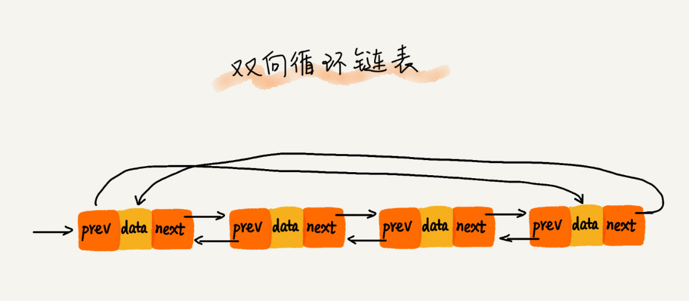

# 链表(Linked list)

## LRU 缓存淘汰算法

缓存是一种提高数据读取性能的技术，当缓存占满后，就需要清理缓存，哪些被清理，哪些被保留，需要缓存淘汰策略决定，常用的有 3 种

- 先进先出策略 FIFO (First In First Out)
- 最少使用策略 LFU (Least Frequently Used)
- 最近最少使用策略 LRU (Least Recently Used)

## 三种最常用的链表结构

- 单链表 (singly linked)
- 双向链表 (doubly linked)
- 循环链表 (circular linked)

### 单链表

- 头节点，记录链表基地址
- 尾节点，指向 NULL

#### 循环链表

特殊的单链表

- 尾节点指向头节点
- 处理环状数据结构，[约瑟夫问题](https://zh.wikipedia.org/wiki/%E7%BA%A6%E7%91%9F%E5%A4%AB%E6%96%AF%E9%97%AE%E9%A2%98)

### 双向链表

- prev next 两个指针，prev 指向前一个，next 指向后一个，耗费更多内存
- 查找节点 q 的 prev，p=q.prev **_O(1)_**，单链表需要从头开始，直到 p.next=q **_O(n)_**
- 按值查询，记录上次的位置 p，以后每次比较 p，>p p.next，
 head
- head.prev -> tail

## Array vs Linked list

| ---            | Array                                                                                                            | Linked list                                                                                                                  |
| -------------- | ---------------------------------------------------------------------------------------------------------------- | ---------------------------------------------------------------------------------------------------------------------------- |
| 底层的存储结构 | 需要连续的内存空间                                                                                               | 不连续，用指针串联                                                                                                           |
| 增删           | 为了保持内存连续，需要数据搬移，**_O(n)_**                                                                       | 只需要改变指针 **_O(1)_**                                                                                                    |
| 查询           | 根据首地址和下标，通过寻址公式计算内存地址 **_O(1)_**                                                            | 通过指针一个个遍历寻找 **_O(n)_**                                                                                            |
| CPU 缓存机制   | 连续空间，预读数据，访问效率高                                                                                   | 不连续，缓存不友好，不能有效预读                                                                                             |
| 性能           | 大小固定，需要连续内存空间   数组太大，内存不足，数组太小，不够用   需要重新申请更大的内存，拷贝原数据耗时 | 大小不限制，天然扩容   频繁增删导致内存频繁申请和释放，容易造成内存碎片   Java 频繁 GC（Garbage Collection，垃圾回收） |

## TODO

### LRU singly linked

### LRU hash table

### LRU array

### 回文 singly linked
